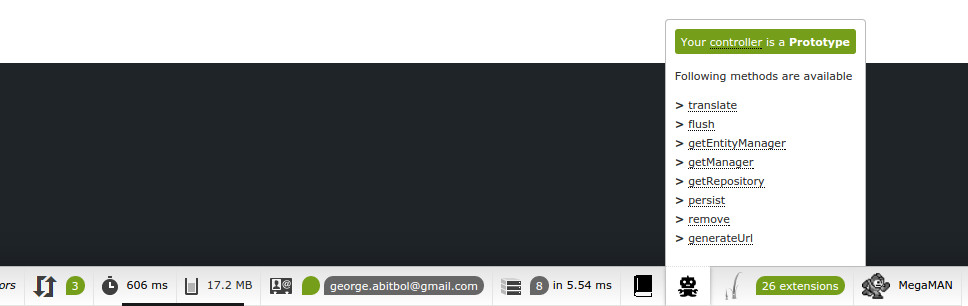
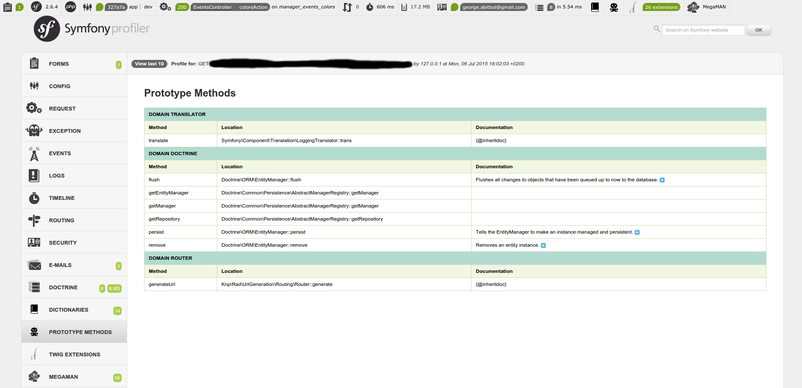

Rapid Application Development : Prototype
====================================
Automatically inject methods into objects

[](https://travis-ci.org/KnpLabs/rad-prototype)
[](https://scrutinizer-ci.com/g/KnpLabs/rad-prototype/?branch=master)
[](https://packagist.org/packages/knplabs/rad-prototype) [](https://packagist.org/packages/knplabs/rad-prototype) [](https://packagist.org/packages/knplabs/rad-prototype) [](https://packagist.org/packages/knplabs/rad-prototype)

# Installation

```bash
composer require knplabs/rad-prototype ~2.0
```

```php
class AppKernel
{
    function registerBundles()
    {
        $bundles = array(
            //...
            new Knp\Rad\Prototype\Bundle\PrototypeBundle(),
            //...
        );

        //...

        return $bundles;
    }
}
```

# Usages

## 1. Method side

You can create injectable methods via dependency injections. You can apply the tag `knp_rad_prototype.prototype_method`.
For example, if I want to expose the method `getRepository` form the `@doctrine` service, I just have to declare a new method:

```yaml
knp_rad_prototype.prototype.method.doctrine.get_repository:
    class: Knp\Rad\Prototype\Prototype\Method
    arguments:
       - @doctrine
       - getRepository
   tags:
       - { name: knp_rad_prototype.prototype_method, alias: getRepository, domain: doctrine }
```

The first argument should be a service or a classname (for static methods), the second argument should be a method name. In this case, the method will be `@doctrine->getRepository()`.

The `alias` tag option represent the method name inside the prototype, so in this case, I can call the method with `$this->getRepository()`.
Finaly, the `domain` tag option represent the domain of this method, a prototype can recieve method of some domains.

## 2. Prototype side

### 2.1. Attach methods to a controller

Access to methods from a controller

Your controller should implements the `Knp\Rad\Prototype\Prototype`. You can also use the basic implementation via the trait `Knp\Rad\Prototype\Prototype\Controller`

```php
namespace AppBundle\Controller;

use Knp\Rad\Prototype\Prototype;

class ProductController implements Prototype
{
    use Prototype\Controller;

    public function testAction($id) 
    {
        $product = $this->getRepository('AppBundle:Product')->find($id);

        $this->persist($product);
        $this->flush();

        // ...
    }
}
```

## 3. Web Debug Toolbar

When your controller implements the `Knp\Rad\Prototype\Prototype` interface, the following icon will appear into the Symfony web debug toobar.



And you can also access to every accessable methods from your prototypes from the Symfony profiler interface


